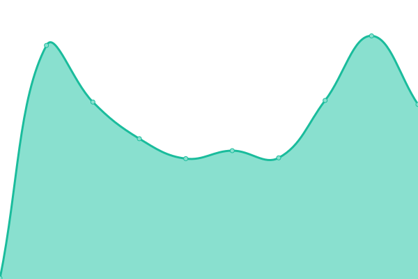
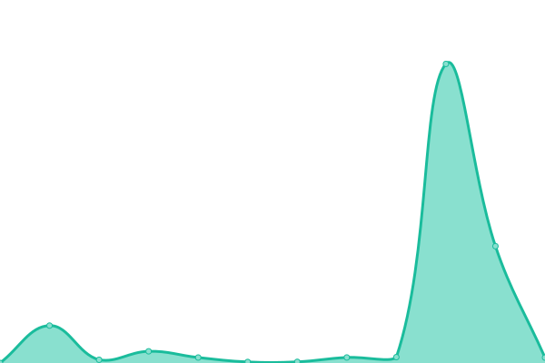
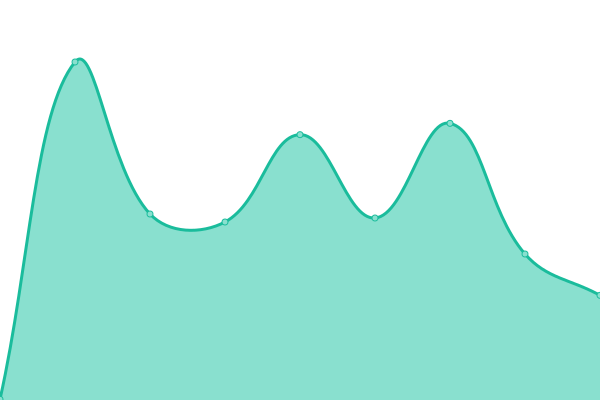

# [📈 Live Status](https://caleb-brown.github.io/upptime): <!--live status--> **🟧 Partial outage**

This repository contains the open-source uptime monitor and status page for [Caleb Brown](https://caleb-brown.dev), powered by [Upptime](https://github.com/upptime/upptime).

With [Upptime](https://upptime.js.org), you can get your own unlimited and free uptime monitor and status page, powered entirely by a GitHub repository. We use [Issues](https://github.com/caleb-brown/upptime/issues) as incident reports, [Actions](https://github.com/caleb-brown/upptime/actions) as uptime monitors, and [Pages](https://caleb-brown.github.io/upptime) for the status page.

<!--start: status pages-->
<!-- This summary is generated by Upptime (https://github.com/upptime/upptime) -->
<!-- Do not edit this manually, your changes will be overwritten -->
<!-- prettier-ignore -->
| URL | Status | History | Response Time | Uptime |
| --- | ------ | ------- | ------------- | ------ |
|  [Main Site](https://caleb-brown.dev) | 🟩 Up | [main-site.yml](https://github.com/caleb-brown/upptime/commits/HEAD/history/main-site.yml) | 

 181ms
     
 | 

<a href="https://status.caleb-brown.dev/history/main-site">100.00%</a>
    

|  [Gitea](https://projects.caleb-brown.dev) | 🟥 Down | [gitea.yml](https://github.com/caleb-brown/upptime/commits/HEAD/history/gitea.yml) | 

 167ms
     
 | 

<a href="https://status.caleb-brown.dev/history/gitea">0.00%</a>
    

|  [Audiobookshelf](https://abs.caleb-brown.dev) | 🟩 Up | [audiobookshelf.yml](https://github.com/caleb-brown/upptime/commits/HEAD/history/audiobookshelf.yml) | 

 276ms
     
 | 

<a href="https://status.caleb-brown.dev/history/audiobookshelf">98.07%</a>
    

|  [Immich](https://photos.caleb-brown.dev) | 🟩 Up | [immich.yml](https://github.com/caleb-brown/upptime/commits/HEAD/history/immich.yml) | 

 293ms
     
 | 

<a href="https://status.caleb-brown.dev/history/immich">98.80%</a>
    

|  [Overseerr](https://overseerr.caleb-brown.dev/api/v1/status) | 🟩 Up | [overseerr.yml](https://github.com/caleb-brown/upptime/commits/HEAD/history/overseerr.yml) | 

 523ms
     
 | 

<a href="https://status.caleb-brown.dev/history/overseerr">99.61%</a>
    

|  [Tautulli](https://tautulli.caleb-brown.dev) | 🟩 Up | [tautulli.yml](https://github.com/caleb-brown/upptime/commits/HEAD/history/tautulli.yml) | 

 377ms
     
 | 

<a href="https://status.caleb-brown.dev/history/tautulli">100.00%</a>
    

|  [RomM](https://romm.caleb-brown.dev) | 🟩 Up | [rom-m.yml](https://github.com/caleb-brown/upptime/commits/HEAD/history/rom-m.yml) | 

 235ms
     
 | 

<a href="https://status.caleb-brown.dev/history/rom-m">100.00%</a>
    

|  [Nextcloud](https://cloud.caleb-brown.dev) | 🟥 Down | [nextcloud.yml](https://github.com/caleb-brown/upptime/commits/HEAD/history/nextcloud.yml) | 

 151ms
     
 | 

<a href="https://status.caleb-brown.dev/history/nextcloud">0.00%</a>
    

<!--end: status pages-->

[**Visit our status website →**](https://caleb-brown.github.io/upptime)

## 📄 License

- Powered by: [Upptime](https://github.com/upptime/upptime)
- Code: [MIT](./LICENSE) © [Anand Chowdhary](https://anandchowdhary.com), supported by [Pabio](https://pabio.com)
- Data in the `./history` directory: [Open Database License](https://opendatacommons.org/licenses/odbl/1-0/)
